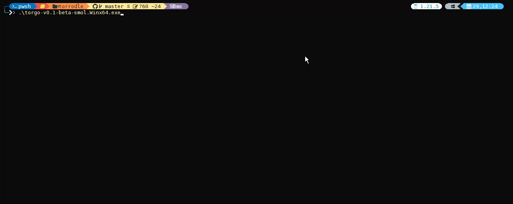

<h1 align="center">torgo</h1>

<p align="center"><strong><i>A mighty all-in-one magnet scraper & streamer</i></strong></p>

<p align="center"></p>

<p align="center">
     <a href="./LICENSE.txt"></a>
</p>

<div align="center">
    <strong>
    <a href="#features">Features</a> |
    <a href="#installation">Install</a> |
    <a href="providers.md">Providers</a> |
    <a href="CLI.md">CLI</a> |
    <a href="API.md">API</a> 
    </strong>
</div>

---

**torgo** is a command-line program which searches and gathers magnet links of movies, tv shows, animes and porn videos from a variety of [providers](providers.md).
It then streams the torrent via HTTP (along with its subtitles) and plays it with a user preferred video player (such as *vlc* and *mpv*).
Currently I am only getting this to be in a working state. 

<sub>Note: The original Torrodle repo has been archived since April 2023 and has not been updated in a while, I liked the project (thanks for inspiring me tnychn!) so I just wanted to get it in a working state again.
I have also made modifications so that it deletes the downloads from your `os.TempDir()` or the one you set as `DataDir` in `~/.torrodle.json` when quitting the program. Since I am only trying to get it in a working state, options will be added later to toggle keeping/deleting downloads.
I personally do it this way because I have mapped my gpu vram as a disk so that my mechanical drive suffers no wear and tear.
> If you don't know what BitTorrent is, you shouldn't be using **torrodle**.
> There are some copyrighted content which might be illegal downloading them in your country.

## Table of Contents
- [Features](#features)
- [Installation](#installation)
  - [Binary](#binary)
  - [Go Get](#go-get)
  - [Build From Source](#build-from-source)
    - [Dependencies](#dependencies)
- [Usage](#usage)
- [Configuration File](#configurationfile)
- [Caveats](#caveeats)
- [Contributing](#contributing)
- [Credit](#credit)

    
## Features

* 🔥 Blazing fast
* 🚸 User-friendly (debatable)
* 🤖 Built-in torrent streaming client via HTTP (refined from [`go-peerflix`](https://github.com/Sioro-Neoku/go-peerflix))
* 🔰 Watch the video while it is being downloaded
* 🔎 Query multiple providers in a single search
* 🚀 Sorted results from 13 different providers at once 
* 📄 Along with subtitles fetching for the video (using [`osdb`](https://github.com/Sioro-Neoku/go-peerflix))
* Support for playing with mpv/vlc on Win/Linux/Mac(?)/Android (Termux) *Android does not have subtitle support yet unless embedded*

## Installation

### Binary

Download the latest stable release of the binary at [releases](https://github.com/stl3/torrodle/releases).

### Go Get

Make sure you have **Go 1.12+** installed on your machine.

`$ go get github.com/stl3/torrodle/cmd/...`

### Build From Source

Make sure you have **Go 1.12+** installed on your machine.

```shell script
$ git clone github.com/stl3/torrodle.git
$ cd torrodle
$ go build cmd/torrodle/main.go
```

#### Dependencies

See [`go.mod`](./go.mod).

1. [logrus](https://github.com/sirupsen/logrus) -- better logging
2. [goquery](https://github.com/PuerkitoBio/goquery) -- HTML parsing
3. [torrent](https://github.com/anacrolix/torrent) -- torrent streaming
4. [osdb](https://github.com/oz/osdb) -- subtitles fetching from OpenSubtitles
5. [go-humanize](https://github.com/dustin/go-humanize) -- humanizing file size words
6. [color](https://github.com/fatih/color) -- colorized output
7. [tablewriter](https://github.com/olekukonko/tablewriter) -- table rendering
8. [survey](https://github.com/AlecAivazis/survey) -- pretty prompting

## Usage

For command-line (CLI) usage, see [`CLI.md`](CLI.md).

For API usage, see [`API.md`](API.md).

## Configurationfile
~/.torrodle.json

```
"DataDir": "E:/exampledir",
"ResultsLimit": 150,
"TorrentPort": 56666,
"HostPort": 8080,
"Proxy": "https://example_proxy_address:8008",
"EstablishedConnsPerTorrent": 25,
"HalfOpenConnsPerTorrent": 25,
"TotalHalfOpenConns": 50,
"eztv_cookie": "cookie_value"
"Debug": false
```
Change `DataDir` if you want a custom path for where it downloads files
Change `TorrentPort` to the port you open/forwarded to use with torrents
Change `HostPort` to the port you want to host the file from
Change `Proxy` to whatever proxy you want to use ([anacrolix/torrent](https://pkg.go.dev/github.com/anacrolix/torrent?utm_source=godoc#ClientConfig.HTTPProxy) - seems to use this only for fetching metainfo and webtorrent seeds but not for the transport of down/up traffic itself

## Caveeats

In Android, when quitting the player you have to manually stop the server. On Windows this is not an issue.

## Contributing

If you have any ideas on how to improve this project or if you think there is a lack of features,
feel free to open an issue, or even better, open a pull request. All contributions are welcome!

## Credit

Original repo [now archived since April 2023]: Made with ♥︎ by tnychn MIT © 2019 Tony Chan 
[@tnychn](https://github.com/tnychn)'s [torrodle](https://github.com/tnychn/torrodle).

This project is inspired by [@Fabio Spampinato](https://github.com/fabiospampinato)'s [cliflix](https://github.com/fabiospampinato/cliflix).

Torrent streaming technique adapted from [@Sioro Neoku](https://github.com/Sioro-Neoku)'s [go-peerflix](https://github.com/Sioro-Neoku/go-peerflix).


